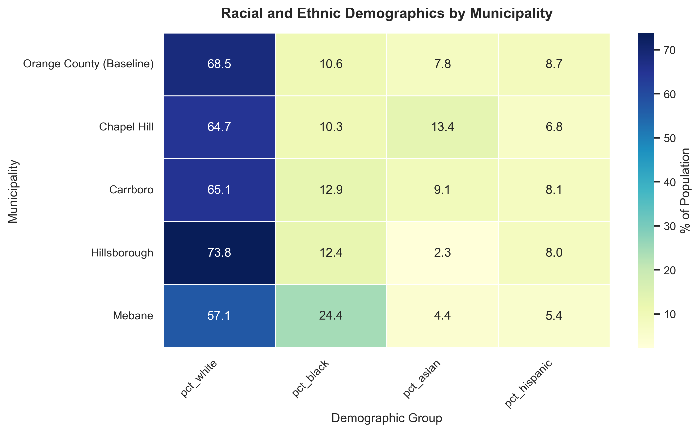
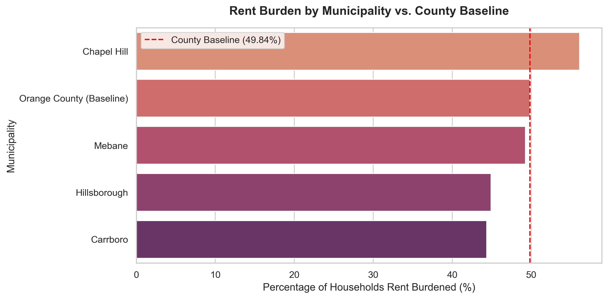
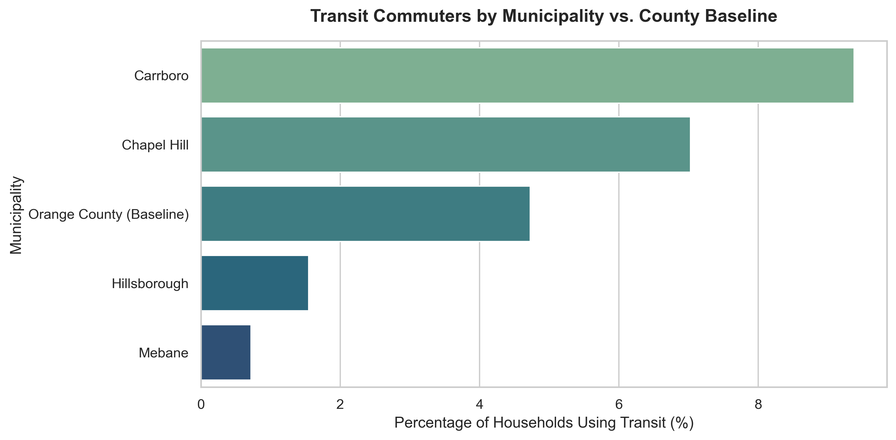
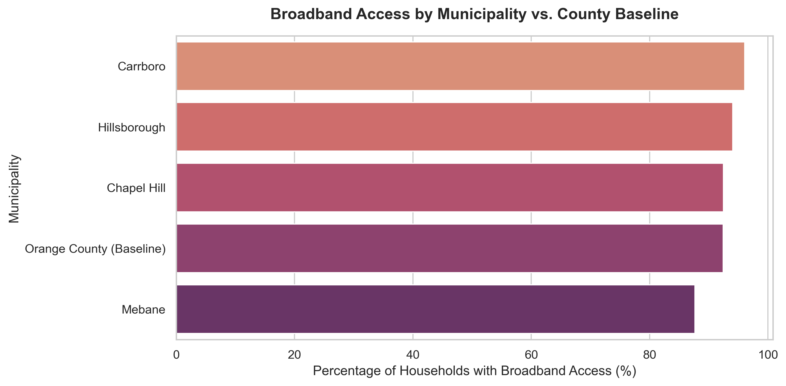
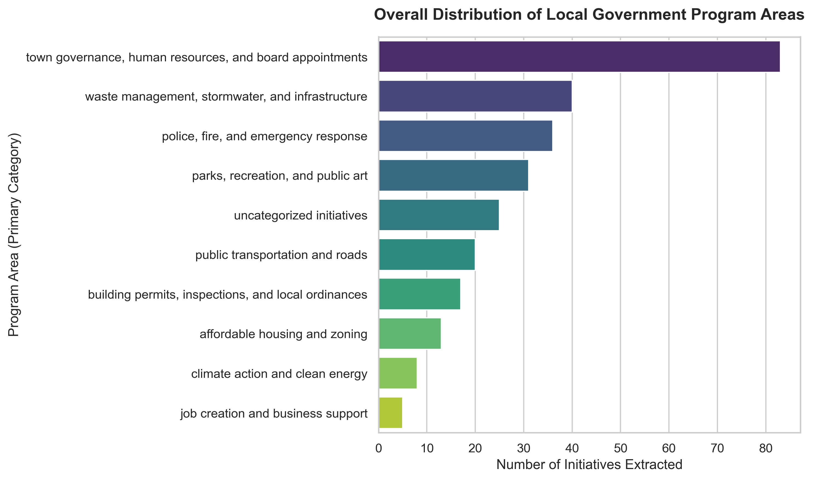
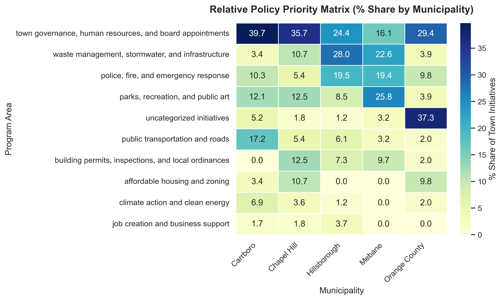
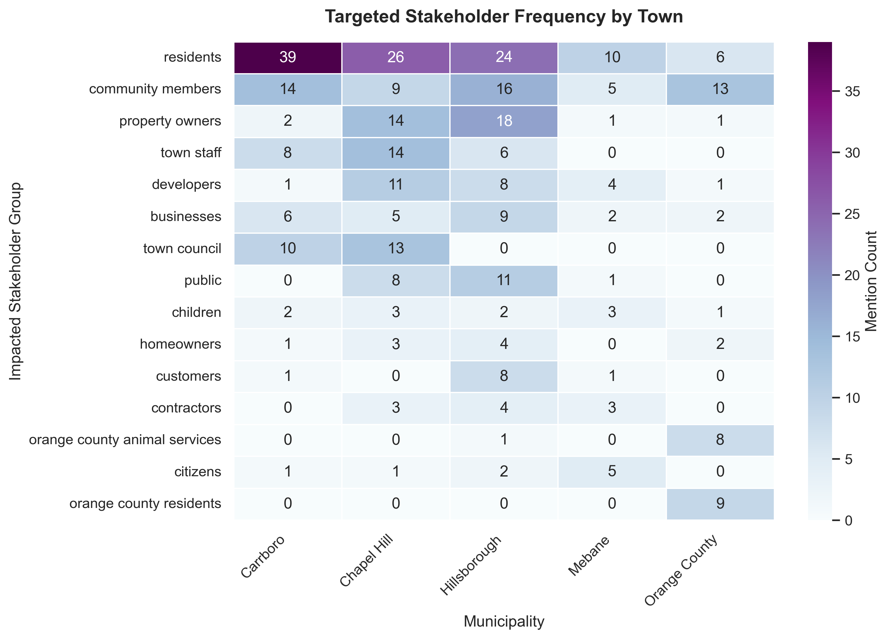

# Analyzing Government Priorities in Orange County Using NLP and MTP

Goal of this project is to extract and analyze government priorities in Orange County North Carolina using Natural Language Processing for text summarization and Meaning-Typed Programming to extract government priorities.

Created using assistance from Gemini AI. 

## Files Prepping for BERTopic

Before running BERTopic modeling on the municipality website text, the text must be scraped from the various government websites in Orange County, NC, cleaned, and then analyzed. 

### initial_scrape.py 
A simple BFS site spider using curl_cffi.requests and BeautifulSoup that crawls a list of municipality homepages, extracts unique paragraph-like text blocks, skips common binary assets and PDFs (tracking skipped PDF URLs), rate-limits requests, and writes results to municipality_spider_data.json and skipped_pdfs.json. 

### json_cleaning.py
Cleans the JSON file using the following cleaning parameters to reduce characters fed to NLP or MTP: 
1. Excludes paragraphs if the average word length is < 3 or greater than 12
2. Excludes paragraphs if the ratio of symbols to words is greater than 0.1/
3. Excludes paragraphs if the number of stop words is less than 2.

### individual_stats.py
Calculates the statistics per municipality for:
- Raw subpages vs. cleaned subpages
- Raw paragraphs vs. cleaned paragraphs
- Raw words vs. cleaned words

Outputs file to municpality_counts_breakdown.csv

### text_analytics.py
Calculates the average statistics for:
- Raw subpages vs. cleaned subpages
- Raw paragraphs vs. cleaned paragraphs
- Raw words vs. cleaned words

Also calculates the gini index of the cleaned paragraphs:
    A Gini of 0 means perfect equality (all municipalities have the same amount of text).
    A Gini of 1 means maximal inequality (one municipality has all the text).

Outputs file to summary_average_stats.csv

## BERTopic Modeling - BERT.py
Here, SBERT is used to do topic modeling to further reduce and organize the text from the municipality websites before feeding them to an LLM using MTP. 

First, it initializes a multilingual SBERT model (paraphrase-multilingual-MiniLM-L12-v2) to handle text encoding and sets up an empty dictionary to track the topic models for each municipality.

Then it initializes a loop to process the data from each municipality:
1. It flattens the lists of text, strips out empty strings, and checks if there are at least 5 valid documents to ensure HDBSCAN clustering won't fail.
2. It converts the valid text strings into dense semantic vectors using SBERT.
3. To prevent crashes on smaller datasets, it dynamically scales the parameters for UMAP (dimensionality reduction) and HDBSCAN (clustering) based on the exact number of documents available for that specific municipality.
4. It initializes a CountVectorizer to remove English stopwords, builds the BERTopic model, fits it to the text embeddings, and extracts the topic metadata.
5. it takes the topic dataframes generated for each municipality, adds a column specifying the municipality name, merges them into one master dataset, and exports the results to both CSV and JSON formats. It also creates a JSON export made to be fed to the LLM using MTP that:
- Skip the outlier/noise topic, labeled as -1
- Gets the topic name, id, keywords and the paragraphs that were representative of that topic

## MTP Government Initiative Extraction -- mtp.jac

Sets up an object for the LLM to extract policy initiatives and related values:

```

obj PolicyInitiative {
    has municipality_name: str;
    has topic_id: int;                        # Links the LLM extraction back to the BERTopic cluster
    has primary_category: PolicyPriorityArea;
    has representation: list[str];            # Lists the keywords that represent the topic, extracted from BERTopic
    has budget_allocation: float | None;
    has impacted_stakeholders: list[str];     # Identifies who the policy affects (e.g., "Homeowners", "Contractors")
    has summary: str;
    has related_doc_count: int;
}
```

Also sets up an enum with the possible policy initiative topic areas for it to choose from"

```
enum PolicyPriorityArea {
    HOUSING = "affordable housing and zoning",
    ENVIRONMENTAL_RESILIENCE = "climate action and clean energy",
    ECONOMIC_DEVELOPMENT = "job creation and business support",
    COMMUNITY_SAFETY = "police, fire, and emergency response",
    TRANSIT_INFRASTRUCTURE = "public transportation and roads",
    PARKS_AND_CULTURE = "parks, recreation, and public art",
    PUBLIC_ADMINISTRATION = "town governance, human resources, and board appointments",
    PUBLIC_WORKS = "waste management, stormwater, and infrastructure",
    CODE_ENFORCEMENT = "building permits, inspections, and local ordinances",
    UNKNOWN = "uncategorized initiatives"
}
```

Defines a loop that processes a list of documents in batches, extracting policy initiatives using an LLM, and saving the results to a JSON file. It includes error handling and allows for resuming from a specific index if needed.

### Merge the extracted initiatives into one document -- merge_json.py

As a result of using the free Gemini tier, extracting the initiatives using the byLLM model hit rate limits often. This file merges the extracted json files together.

## Census Analysis

### Census.py

Pulls the following demographics and statistics for the four municipalities and the county:

```
    'B25070_010E',   # Rent is 50.0% or more of income
    'B08301_001E',   # Total Workers 16+
    'B08301_010E',   # Workers who commute via Public Transportation
    'B28002_001E',   # Total Households
    'B28002_004E',   # Households with Broadband of any type
    'B19013_001E',   # Median Household Income
    'B01003_001E',   # Total Population
    'B03002_003E',   # Non-Hispanic White alone
    'B03002_004E',   # Non-Hispanic Black or African American alone
    'B03002_006E',   # Non-Hispanic Asian alone
    'B03002_012E'    # Hispanic or Latino (Any race)
```

### Census_Data_Analysis.py 

Analyzes Census data from the four municipalities and the county. Due to limited time, national stats are referenced via Census press releases and therefore may refer to slightly different years than the data pulled for Orange County from the Census's American Community Survey 5-Year Data 2022. 

#### Calculates demographic and ethnicity percentages:


#### Calculates percentage of households with rent burden (Rent is 30.0% or more of income):


Nearly half (49.7%) of renters in 2023 had rent that was 30% or more of their income according to [Census.gov](https://www.census.gov/newsroom/press-releases/2024/renter-households-cost-burdened-race.html). Chapel Hill has higher than the nation and higher than the Orange County baseline of the percentage of households with rent burden. 

#### Calculates percentage of workers who commute via public transit:

The national average in 2024 for those who commuted via public transit was 3.7 percent according to [Census.gov](https://www.census.gov/topics/employment/commuting/guidance/acs-1yr.html). Chapel Hill and Carborro are above this average. 

#### Calculates households with broadband access: 


Only Mebane falls below the [national average](https://www.census.gov/newsroom/press-releases/2024/computer-internet-use-2021.html) of 90% of households having Broadband access. 


## Analysis of Findings -- Initiative_Analysis.ipynb

Overall, when looking at all government priorities mentioned across all websites, "town governance, human resources, and board appointments" was the top referenced topic area, with job creation being the least referenced:



This project also looked at topic area by muncipality:



Noteably, Chapel Hill, which has a rent burden of over 50%, had 10% of it's topics extracted referencing affordable housing, the highest in the region. 

Carrboro leads the region in public transit commuters, with 9.38% of workers utilizing public transportation—nearly double the county average of 4.73%. Correspondingly, 17% of the initiatives extracted from the Carrboro website referenced public transit or roads. 



While residents and community members are often the primary stakeholders extracted from all websites, there are also frequent mentions of the business community: “property owners” (36 mentions) and “developers” (25) outpace “homeowners” (10).

## Future Work

## Thank You
This work was inspired by the paper "Mapping Local Government Priorities: A Web-Mining Approach for Regional Research," which maps government priorities in Germany.
